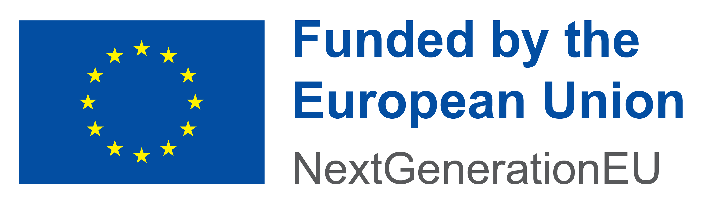

Acknowledgements
================

From July 2024 to June 2026, CHarm is being developed within a project funded 
by the EU NextGenerationEU through the Recovery and Resilience Plan for 
Slovakia under the project No. 09I03-03-V04-00273.

.. centered:: |fig1|   |fig2|

.. |fig2| image:: ../img/acknowledgements/recovery-and-resilience-plan.png
   :width: 25 %
